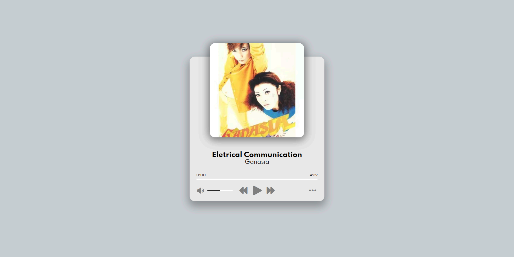

<div align="center">

# 🎵 Music Player

[](https://developer.mozilla.org/en-US/docs/Web/HTML) [](https://sass-lang.com) [](https://developer.mozilla.org/en-US/docs/Web/JavaScript) [](https://vitejs.dev)

_A modern music player interface running entirely in the browser — no database required._

</div>

## 📖 About

Music Player is a browser-based music player built with vanilla JavaScript, SASS and Vite. It features a modern interface centered around a player with album art, real-time progress tracking, and intuitive controls for play/pause, next, and previous tracks. Volume control comes with a mute toggle, and keyboard users get a dedicated shortcut panel for full hands-free control. The player comes preloaded with 6 curated tracks stored locally — no backend or database needed.

## ✨ Features

- 🎨 **Modern UI** — clean, centered player with album art display
- ▶️ **Playback Controls** — play/pause, next and previous track buttons
- 📊 **Progress Bar** — real-time seek bar with current time and total duration counter
- 🔊 **Volume Control** — drag slider to adjust volume, click the icon to mute/unmute
- ⌨️ **Keyboard Shortcuts** — available on keyboard-equipped devices only

  | Key | Action                  |
  | --- | ----------------------- |
  | `→` | Seek forward 5 seconds  |
  | `←` | Seek backward 5 seconds |
  | `↑` | Increase volume         |
  | `↓` | Decrease volume         |
  | `N` | Next track              |
  | `B` | Previous track          |
  | `P` | Play / Pause            |
  | `M` | Mute / Unmute           |

- 🎵 **6 Preloaded Tracks** — curated songs ready to play out of the box
- 📦 **No Backend** — all data stored locally in JavaScript

## 🖥️ Demo



🔗 [Live Demo](https://pmbfsa.github.io/music-player)

## 🚀 Getting Started

### Prerequisites

- [Node.js](https://nodejs.org/) (v18 or higher recommended)
- npm

### Installation

1. Clone the repository:

```bash
git clone https://github.com/pmbfsa/music-player.git
cd music-player
```

2. Install dependencies:

```bash
npm install
```

3. Start the development server:

```bash
npm run dev
```

4. Build for production:

```bash
npm run build
```

## 🛠️ Built With

| Technology                                                            | Version | Description                   |
| --------------------------------------------------------------------- | ------- | ----------------------------- |
| [HTML5](https://developer.mozilla.org/en-US/docs/Web/HTML)            | —       | Semantic markup and structure |
| [SASS (sass-embedded)](https://sass-lang.com)                         | 1.100.0 | CSS preprocessor for styling  |
| [JavaScript](https://developer.mozilla.org/en-US/docs/Web/JavaScript) | Vanilla | Core logic and interactivity  |
| [Vite](https://vitejs.dev)                                            | 8.0.12  | Build tool and dev server     |
| [Font Awesome](https://fontawesome.com)                               | 7.2.0   | Icon library                  |

## 📁 Project Structure

```
music-player/
├── docs/                   # Build output for GitHub Pages deploy
├── public/
│   ├── images/             # Album art images
│   ├── music/              # MP3 track files
│   └── favicon.png
├── src/
│   ├── assets/
│   │   └── fonts/          # Font Awesome fonts
│   ├── sass/
│   │   ├── fontawesome/    # Font Awesome SASS files
│   │   └── style.scss      # Main stylesheet
│   └── main.js             # Main JavaScript file
├── index.html
├── package.json
├── screenshot.png
└── vite.config.js
```

## 📄 License

This project is licensed under the **GNU General Public License v3.0** — see the [LICENSE](./LICENSE) file for details.
